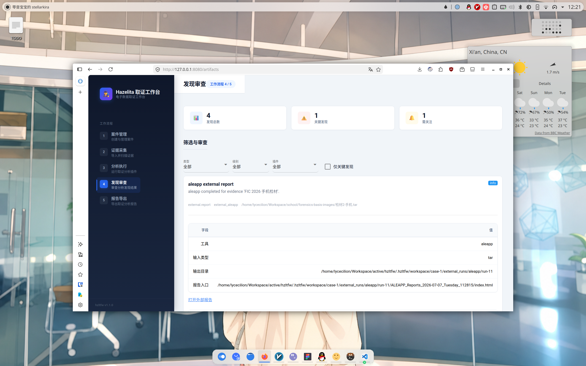

<!-- markdownlint-disable MD033 MD036 MD041 -->

<div align="center">


# Hazelita Forensics Workbench

面向电子数据取证课程实训的本地取证工作台

[](https://git.io/typing-svg)

[English](README.md) / [网站](https://hzltfw.stellalyr.ink)

</div>

> [!WARNING]
> 本项目的课程开发周期已经结束。<br/>
> 为了保持 `hzltfw` 的轻量化和可移植性，本仓库不再开发新功能，也不再接受 feature PR。

## 📖 关于

`hzltfw` 是一款为「电子数据取证基础」课程设计的本地取证工作台。

它不是完整商业取证套件，而是一个可重复演示的本地闭环：创建案件、添加准备好的检材、扫描文件、运行分析插件、在 GUI 中审查 artifact，并导出 Markdown 报告或可携带报告包。

## ✨ 功能

`hzltfw` 的最终课程交付版覆盖以下功能：

- 本地 NiceGUI 工作流：案件管理、证据采集、分析执行、发现审查和报告导出。
- 支持添加文件、目录或压缩包路径作为检材，并将文件索引到 `evidence_files`。
- Windows 导出目录检查：在导入前识别常见用户目录、浏览器 profile、注册表 hive、事件日志、回收站等来源类别。
- 默认内置插件：hash 清单、文件类型伪装检测、关键词/正则命中、ZIP 压缩包索引、图片/PDF/DOCX 元数据提取。
- 外部工具适配：可手动配置并运行本机 ALEAPP、iLEAPP 和 Hindsight，将输出保存到案件工作区并生成标准 artifact。
- 发现中心支持按 artifact 类型、严重级别、插件和关键发现筛选，并保留原始 JSON 详情。
- 支持导出单文件 Markdown 报告，也支持复制外部工具输出的可携带报告包。
- 使用 Python 3.12+、SQLite、SQLModel 和 `uv`，兼顾 Windows 与 Linux 本地运行。

课程样本应由用户自行准备或从镜像中导出，不应提交到本仓库。

## 👀 预览



## 🚀 快速开始

### 启动 `hzltfw`

确保你的设备安装了 `uv`。Clone 该 Repo，安装项目依赖并启动本地 GUI：

```bash
uv sync
uv run hzltfw
```

默认情况下，Web UI 绑定在 `127.0.0.1:8080`。如需更换端口：

```bash
uv run hzltfw --host 127.0.0.1 --port 8081
```

运行时数据会写入当前工作目录下的 `.hzltfw/`：

- `.hzltfw/hzltfw.db`：本地 SQLite 数据库。
- `.hzltfw/workspace/`：检材元数据、插件输出和外部工具输出。
- `.hzltfw/config.json`：语言和外部工具命令配置。

不要提交 `.hzltfw/`、样本检材或生成报告，除非课程提交明确要求提交导出的报告成品。

## 📝 使用

1. 打开本地 UI。
2. 在 **Cases** 页面创建案件。
3. 在 **Evidence** 页面添加文件、目录或压缩包检材。
4. 扫描检材，将文件索引到 `evidence_files`。
5. 在 **Analysis** 页面运行默认内置插件。
6. 如有需要，在 **Analysis** 页面配置并运行 ALEAPP、iLEAPP 或 Hindsight。
7. 在发现中心 / artifacts 页面筛选和审查分析结果。
8. 在 **Reports** 页面导出 Markdown 报告或可携带报告包。

如果检材样本来自 Windows 镜像或 E01，请先用专门的取证工具导出目标文件，再把导出的目录导入 `hzltfw`。详见 [docs/EVIDENCE_HANDOFF.zh-CN.md](docs/EVIDENCE_HANDOFF.zh-CN.md)。

## ⚙️ 配置

`hzltfw` 可以调用本机已安装的 ALEAPP、iLEAPP 和 Hindsight 适配器。外部工具不会由本仓库安装、vendor 或提交。可以在 **Analysis** 页面的命令配置区域填写，也可以直接编辑 `.hzltfw/config.json`。

已支持适配器：

| 工具 | 推荐输入 | 说明 |
| --- | --- | --- |
| ALEAPP | Android 文件系统导出目录或压缩包 | 输入类型使用 `fs`、`zip`、`tar` 或 `gz`。 |
| iLEAPP | iOS/iPadOS 文件系统、iTunes 备份或压缩包 | 输入类型使用 `fs`、`zip`、`tar`、`gz`、`itunes` 或 `file`。 |
| Hindsight | 浏览器 profile 目录 | 优先给完整 Chrome/Edge/Chromium profile 目录，不建议只给单个 `History`。 |

示例 `.hzltfw/config.json`：

```json
{
  "language": "zh-CN",
  "external_tools": {
    "aleapp": {
      "name": "aleapp",
      "command": ["python", "/path/to/ALEAPP/aleapp.py"],
      "enabled": true
    },
    "ileapp": {
      "name": "ileapp",
      "command": ["/path/to/ileapp"],
      "enabled": true
    },
    "hindsight": {
      "name": "hindsight",
      "command": ["python", "/path/to/hindsight.py"],
      "enabled": true
    }
  }
}
```

每个 `command` 都必须是 JSON 字符串数组。不要使用 shell alias、管道、重定向、环境变量展开或平台专属 shell 语法；程序会用 `shell=False` 调用命令，以保持 Windows/Linux 跨平台。

推荐命令示例：

```json
["C:\\Tools\\ALEAPP\\.venv\\Scripts\\python.exe", "C:\\Tools\\ALEAPP\\aleapp.py"]
["C:\\Tools\\iLEAPP\\iLEAPP.exe"]
["C:\\Tools\\hindsight\\.venv\\Scripts\\python.exe", "C:\\Tools\\hindsight\\hindsight.py"]
```

```json
["/opt/ALEAPP/.venv/bin/python", "/opt/ALEAPP/aleapp.py"]
["/opt/iLEAPP/iLEAPP.AppImage"]
["/opt/hindsight/.venv/bin/python", "/opt/hindsight/hindsight.py"]
```

如果使用源码版工具，建议优先使用该工具自己的虚拟环境 Python，不要复用 `hzltfw` 的 Python 环境。这样 ALEAPP、iLEAPP 和 Hindsight 的依赖冲突会被隔离。

运行外部分析的流程：

1. 添加并扫描检材。
2. 打开 **Analysis** 页面。
3. 检查外部工具健康状态。健康检查会用 `--help` 调用配置好的命令。
4. 将检材探测结果作为提示，再由操作员选择工具和输入类型。
5. 启动外部工具运行，并等待执行完成。
6. 打开生成的 `external.report` artifact，或导出报告包。

外部工具每次运行会写入：

```text
.hzltfw/workspace/case-<case-id>/external_runs/<tool>/run-<plugin-run-id>/
```

涉及外部工具时，建议使用 **Report bundle** 导出。报告包会复制外部 HTML/JSONL/XLSX 输出，并从 `report.md` 使用相对链接引用，方便提交和在另一台机器上打开。更多细节见 [docs/EXTERNAL_TOOLS.zh-CN.md](docs/EXTERNAL_TOOLS.zh-CN.md)。

## 📁 项目架构

```text
src/hzltfw/
  core/      数据库、模型、扫描器、插件契约、runner、报告和外部工具封装
  plugins/   内置分析插件和外部工具适配器
  ui/        NiceGUI 页面、artifact 展示组件和本地交互界面
  utils/     哈希、时间戳和国际化等小型共享工具
```

核心数据流：

1. `EvidenceItem` 记录用户添加的文件或目录检材。
2. core scanner 遍历检材并生成 `EvidenceFile` 索引。
3. runner 为每个插件创建 `PluginRun`，并把 `EvidenceItem` 与已索引文件传给插件。
4. 插件只返回 `ArtifactCreate`，不直接写数据库，也不调用 NiceGUI。
5. runner 持久化 `Artifact`，UI 和报告生成器统一读取 artifact 公共字段和 `data_json`。

更完整的架构说明见 [docs/ARCHITECTURE.md](docs/ARCHITECTURE.md)。

## ✅ 最终功能清单

| 功能 | 实现位置 |
| --- | --- |
| 案件创建、列表和删除 | `core/models.py`, `ui/pages/cases.py` |
| 文件/目录检材添加、扫描和删除 | `core/scanner.py`, `ui/pages/evidence.py` |
| Windows 导出目录检查 | `core/handoff.py`, `ui/pages/evidence.py` |
| MD5/SHA1/SHA256 文件清单 | `plugins/hash_manifest.py` |
| magic-byte 扩展名伪装检测 | `plugins/file_type.py` |
| 邮箱、手机号、学号等演示正则命中 | `plugins/keyword_search.py` |
| ZIP 条目索引和可疑条目名提示 | `plugins/archive_index.py` |
| 图片 EXIF、PDF 元数据、DOCX core properties | `plugins/metadata_extract.py` |
| ALEAPP/iLEAPP/Hindsight 外部报告适配 | `plugins/external_forensics.py` |
| artifact 筛选、详情视图和原始 JSON 查看 | `ui/pages/artifacts.py`, `ui/artifact_views.py` |
| Markdown 报告和报告包导出 | `core/report.py`, `ui/pages/reports.py` |

明确不支持：直接解析 E01/原始磁盘镜像、分区表、NTFS 文件系统重建、递归解压压缩包、完整导入外部工具所有结果。

## 💻 开发

### 基础要求

- Python 3.12+
- uv
- Git
- 可选：支持 flakes 的 Nix

应用技术栈为 Python、NiceGUI、SQLite、SQLModel、ruff 和 pytest。

### Linux

```bash
git clone <repo-url>
cd hzltfw
uv sync --dev
uv run hzltfw
```

如果使用 release 压缩包而不是 Git checkout，先解压并进入项目目录，然后执行同样的 `uv sync --dev` 和 `uv run hzltfw` 命令。

如果使用 Nix：

```bash
nix develop
uv sync --dev
uv run hzltfw
```

Linux 外部工具可以配置为 Python 源码目录、独立可执行文件或 AppImage。如果目标机器因为 FUSE 缺失无法直接运行 AppImage，可以按该外部工具支持的方式解包，或改用对应的二进制 / 源码部署方式。

### Windows

安装 Python 3.12+、Git 和 uv 后运行：

```powershell
git clone <repo-url>
cd hzltfw
uv sync --dev
uv run hzltfw
```

如果使用 release 压缩包，先解压，在项目目录打开 PowerShell，然后执行同样的 `uv sync --dev` 和 `uv run hzltfw` 命令。

在 `.hzltfw/config.json` 中使用 Windows 路径时，需要按 JSON 规则转义反斜杠：

```json
["C:\\Tools\\ALEAPP\\.venv\\Scripts\\python.exe", "C:\\Tools\\ALEAPP\\aleapp.py"]
```

源码版 ALEAPP、iLEAPP 和 Hindsight 建议各自使用独立虚拟环境。如果工具提供 Windows 可执行文件，则可以直接把命令指向该可执行文件。

### 开发检查

提交维护修复或发布前运行：

```bash
uv run ruff check .
uv run pytest
```

## 🚢 发布

当前正式版本：`v1.1.1`。

发布范围、演示路径和已知边界见 [docs/RELEASE_NOTES.zh-CN.md](docs/RELEASE_NOTES.zh-CN.md)。

## 🤝 贡献

本项目已不再接受 feature PR。课程交付结束后，仓库只保留维护性修复、文档修正和发布整理空间。

轻量 Git 协作流程、PR 检查清单和 AI coding 规则见 [docs/CONTRIBUTING.zh-CN.md](docs/CONTRIBUTING.zh-CN.md)。插件接口和最终内置插件说明见 [docs/PLUGIN_CONTACT.zh-CN.md](docs/PLUGIN_CONTACT.zh-CN.md) 与 [docs/PLUGIN_TASKS.zh-CN.md](docs/PLUGIN_TASKS.zh-CN.md)。

## 🙏 致谢

感谢 hzltForens!cs 和 Project Hazelita 社群为 `hzltfw` 提供支持。

## 📄 许可证

[MIT LICENSE](./LICENSE)
